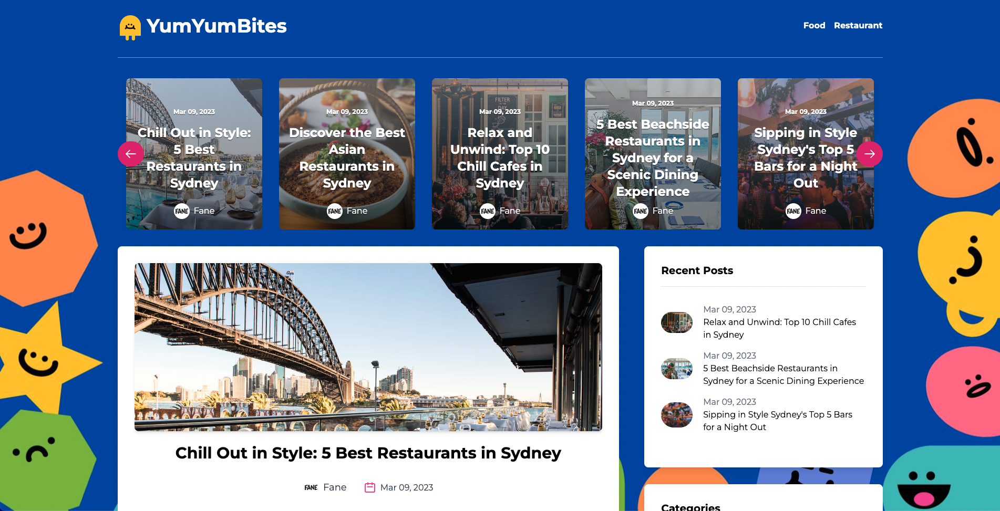
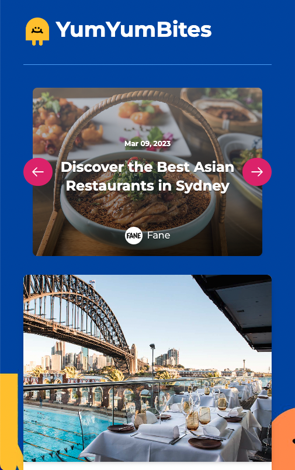

<a href="https://project4-yumyumbites-8cohx7mup-tanakorntree.vercel.app/">
    
</a>

# :taco: YumYumBites

Welcome to [YumYumBites](https://project4-yumyumbites-8cohx7mup-tanakorntree.vercel.app/), your go-to source for food and restaurant content in Sydney! Discover the best culinary spots, mouthwatering reviews, and insider tips as we guide you through Sydney's vibrant dining scene. From trendy cafes to hidden gems, indulge your taste buds with YumYumBites!

## Built with
- React.js
- Next.js
- Tailwind CSS
- Hygraph (GraphQL) for backend
- Deploy on Vercel


### Snapshots

|Desktop|Mobile|
|:-:|:-:|
|  |  |
    
---

## :bell: Put it all together

### :bulb: Features:
- Add comments for the blog and the ability to save a name and an email in the browser for the next time comment.
- Show prior comments for the blogs.
- Article category for food and restaurant for sidebar and nav bar.
- Carousel component to show all contents.
- Mobile-friendly website.

Note: About adding the article and author, still use the hygraph interface to directly put it into the database.

### :spiral_calendar: Challenges:
- Tailwind dependency and how to setup. There are version differences using purge: and content: which impact tailwind usage for the application. 
After moving from purge to content, the code is as below.
    
    ```JavaScript
       /** @type {import('tailwindcss').Config} */
      module.exports = {
        content: [
          "./app/**/*.{js,ts,jsx,tsx}",
          "./pages/**/*.{js,ts,jsx,tsx}",
          "./components/**/*.{js,ts,jsx,tsx}",

          // Or if using `src` directory:
          "./src/**/*.{js,ts,jsx,tsx}",
        ],
        theme: {
          extend: {},
        },
        plugins: [],
      }
    ```
- Carousel component design - It was hard to decide on the packages or pre-set components from Tailwind. Then, the decision was made using the 'react-multi-carousel' package as it matched the planned design.
     
     ```JavaScript
      import Carousel from 'react-multi-carousel';
      import 'react-multi-carousel/lib/styles.css';
     ```
     For the FeaturedPosts component (Carousel), the return from the component is as below using the package.
     
     ```JavaScript
       return (
        <div className="mb-8">
          <Carousel infinite customLeftArrow={customLeftArrow} customRightArrow={customRightArrow} responsive={responsive} itemClass="px-4">
            {dataLoaded && featuredPosts.map((post, index) => (
              <FeaturedPostCard key={index} post={post} />
            ))}
          </Carousel>
        </div>
      );
     ```
- Schema design and a connection was hard to manage as it is always confusing. The hardest thing was the detail inside the post which comprises of:
   - Title, Slug, Excerpt, Content, Featured Image, Featured Post, Author, Categories, and Comment.
   - The schema design includes Author, Category, Comment, and Post.
  <br>
  <a href="https://ibb.co/6rdRf4y">
      
  </a>

### :book: Lesson:
- It is hard to properly design schema in one go and expect it to cover all needs.
- You can face a dilemma or paradox of choice in terms of the package or pre-built components to use.
- Choosing the right database provider is hard and also time-consuming. I choose this graphql as I would like to try this.

### :bookmark: Future updates:
- Create user/author log-in, sign-up, and sign-out.
- Create CRUD interfaces for authors and also users to add comments, create articles, and manage comments visibility.
- Manage the navbar properly to manage more categories.
- Implement a text editor: Integrate a rich text editor into the application.
- Enable image uploading: Configure the text editor's image upload functionality.
